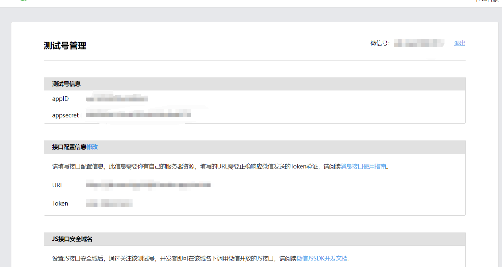
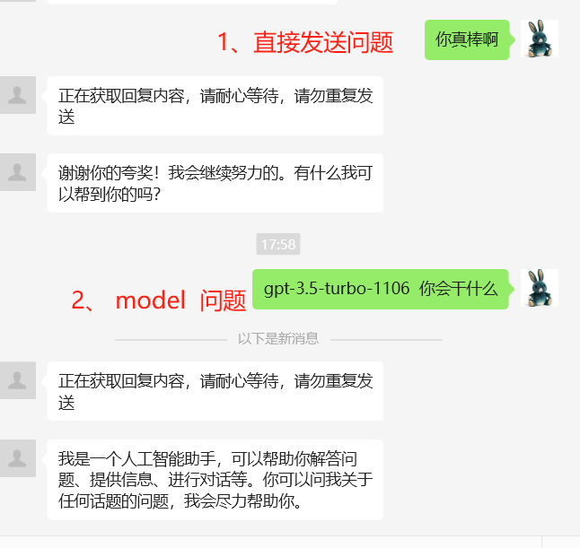

# wechat_gpt

<br/>
<br/>

* 微信公众号实现ChatGPT的对话功能   
* 开箱即用
* 自定义模型


opaoplus--带权限管理和模板消息

opaoqiwei--企业微信版本


## 部署方法

### 提供免费的api
CHAT_URL=https://momo.opao.xyz/v1/chat/completions

APIKEY=sk-F3qfuHj61oET8K9advLSJ8NAP9YDHPOV1vdfn5GDR5sNJwwl

### 1、获取变量
登录微信公众号的后台---建议使用[**测试号**](https://mp.weixin.qq.com/debug/cgi-bin/sandbox?t=sandbox/login), 获取**appID**和**appsecret**  




### 2-1、Vercel一键部署---推荐
[](https://vercel.com/new/clone?repository-url=https%3A%2F%2Fgithub.com%2FCatAnd-Dog%2Fwechat_gpt&env=WX_TOKEN,APPID,APPSECRET,CHAT_URL,APIKEY)

**根据要求填写环境变量**


其中token是自己定义的值。需要记下。


### 2-2、docker compose 部署
```
git clone https://github.com/CatAnd-Dog/wechat_gpt.git   
cd  wechat_gpt
cp .env.example .env
docker compose pull && docker compose up -d
```

**自行修改docker compose环境变量的值**   

此种方式的url=http://ip:34568


### 2-3、Zeabur一键部署  ---- 失效了，不知道什么bug
[](https://zeabur.com/templates/68MAH3?referralCode=CatAnd-Dog)

**根据要求填写环境变量**


### 3、将你的url+/wechat路径和token填入下面【**接口配置信息**】，并提交


比如你的url=https://a.com 
那么你填的就是https://a.com/wechat

ps：访问你的url，会返回 **{"code":200,"data":"success"}** 则部署成功


## ChatGPT对话

记忆：默认记忆最后一次10分钟内消息，循环刷新记忆时间

7条消息记忆。发送【清除】可以重置所有记忆

更多环境变量，请查看.env.example

### 有两种方式

1、直接发送问题。。（默认模型gpt-4o-mini）  比如： 你会干什么？

2、 model+空格+问题。。（自己指定模型） 比如： gpt-4 你会干什么？



## 更新
2024.0518  新增模板消息的详情页，支持html格式
## 后记

探讨?? [**TG**]()