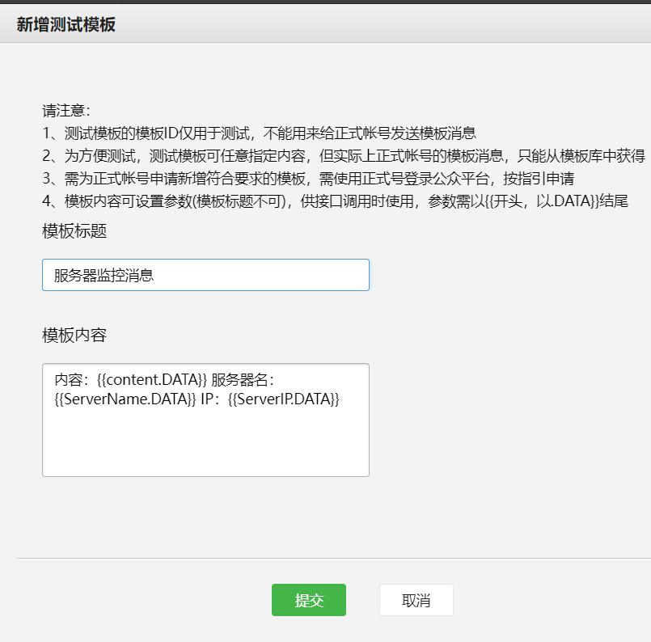

# wechat_gpt

<br/>
<br/>

* 微信公众号实现ChatGPT的对话功能   
* 微信公众号实现消息推送功能   
* 微信公众号用户权限管理【todo】

## 部署方法
### 1、获取变量
登录微信公众号的后台---建议使用[**测试号**](https://mp.weixin.qq.com/debug/cgi-bin/sandbox?t=sandbox/login), 获取**appID**和**appsecret**  


### 2-1、Zeabur一键部署  
[](https://zeabur.com/templates/68MAH3?referralCode=CatAnd-Dog)

**根据要求填写环境变量**

其中token是自己定义的值。需要记下。


### 2-2、docker compose 部署
```
git clone https://github.com/CatAnd-Dog/wechat_gpt.git   

cd  wechat_gpt

copy .env.example .env
```

**然后自行修改env环境变量的值**   
或者也可以在docker compose指定环境变量
```
docker compose up -d
```
此种方式的url=http://ip:34568

### 3、将你的url+/wechat路径和token填入下面【**接口配置信息**】，并提交


比如你的url=https://a.com 
那么你填的就是https://a.com/wechat

ps：访问你的url，会返回 **{"code":200,"data":"success"}** 则部署成功


## 消息推送，哪吒探针

访问公众号后台，记下用户列表对应的**微信号**

按照如下方式新增模板，并填写内容。记下**模板ID**

```
内容：{{content.DATA}} 服务器名：{{ServerName.DATA}} IP：{{ServerIP.DATA}}
```

   



访问你的探针后台，告警--新增通知方式--按照如下方式填写

```
{
"template_id":"模板ID",
    "user":"微信号",
    "urlred":"跳转页，可不填或者填你的探针地址",
    "content":{
    "thing20": {
        "value": "#NEZHA#"
    },
    "thing13": {
        "value": "#SERVER.NAME#"
    },
    "thing26": {
        "value": "#SERVER.IP#"
    }
}
}
```


最后新增[**告警规则**](https://nezha.wiki/guide/notifications.html)即可


## ChatGPT对话

有两种方式

1、直接发送问题。。（默认模型gpt-3.5-turbo）  比如： 你会干什么？

2、 model+空格+问题。。（自己指定模型） 比如： gpt-4 你会干什么？


## 后记

探讨?? [**TG**](https://t.me/aurora_develop)